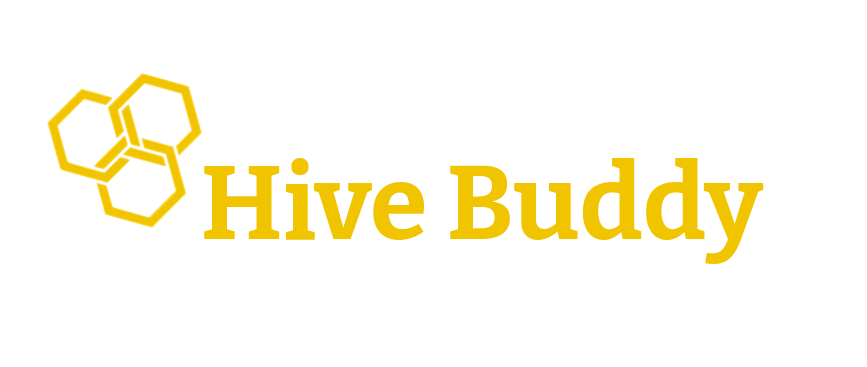

<h1 align="center">

</h1>
<h4 align="center">
Your Beekeeping Companion
</h4>

## 📝 About
A project that focuses on optimizing bee keepers work by collecting and processing data like temperature, humidity, noise level and air gases.

## 🔧 Development

Run application

`./gradlew bootRun`

Watch for changes

`./gradlew build -t -xtest`

## 📣 Roadmap

- **Research and Planning:** Conduct surveys/interviews, identify key data points (temperature, humidity, noise, gases), and review existing solutions.

- **Prototype Development:** Design sensor setups, create a basic data processing application, and develop a user-friendly interface.

- **Testing and Feedback:** Implement prototypes in select apiaries, gather user feedback, and iterate on the design.

- **Advanced Features and Scalability:** Add analytics capabilities, implement cloud storage, and develop mobile applications for real-time monitoring.

- **Launch and Maintenance:** Officially launch the product, provide user documentation, and establish community support forums.

## 🏗️ Contributing

- **Open Collaboration:** Contributions from anyone interested in improving the project are welcome.
- **Respect and Inclusion:** Ensure a respectful environment for all participants, regardless of expertise level, background, or opinion.

### How to Contribute

1. **Joining the Project:**
   - Sign up on the project repository (e.g., GitHub, GitLab).
   - Familiarize yourself with the project's objectives and ongoing tasks.

2. **Reporting Issues:**
   - Use the issue tracker to report bugs or propose enhancements.
   - Provide clear descriptions and necessary context for your reports.

3. **Submitting Code:**
   - Fork the repository and create a feature branch for your changes.
   - Follow coding standards and best practices outlined in the documentation.
   - Include tests wherever applicable.
   - Submit a pull request with a descriptive title and summary of changes.

4. **Documentation Contributions:**
   - Contribute to user guides, API documentation, and tutorials.
   - Ensure all documentation is clear, concise, and up to date.

5. **Participating in Discussions:**
   - Engage in project discussions on forums or chat platforms.
   - Share insights, questions, and suggestions to foster collaboration.

### Review Process

- Contributions will be reviewed by project maintainers before integration into the main codebase.
- Feedback will be provided to ensure code quality and alignment with project goals.

### Licensing

- All contributions fall under the project's chosen license (e.g., MIT License, Apache License), ensuring proper attribution and openness.
